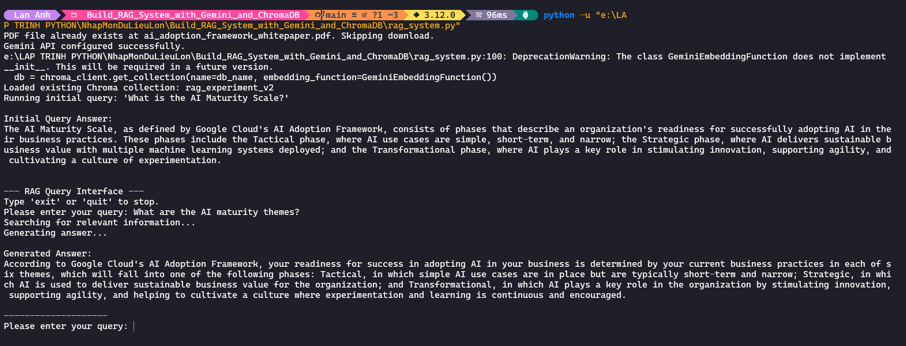

# Build RAG System with Gemini and ChromaDB

This repository contains the code for building a Retrieval-Augmented Generation (RAG) system. This system uses Google's Gemini Pro model and the ChromaDB vector database to answer questions based on the content of a PDF document.

## How It Works

The system follows a standard RAG architecture:

1.  **Document Loading**: A PDF document ("Google Cloud’s AI Adoption Framework") is downloaded from a specified URL.
2.  **Text Processing**: The text is extracted from the PDF and split into smaller, manageable chunks.
3.  **Embedding**: Google's `embedding-001` model is used to generate vector embeddings for each text chunk.
4.  **Vector Storage**: These embeddings are stored in a persistent ChromaDB collection. This process is only done once; on subsequent runs, the system loads the existing database.
5.  **Querying**: When a user asks a question, the system generates an embedding for the query.
6.  **Information Retrieval**: The system queries the ChromaDB database to find the most relevant text chunks (passages) based on the query embedding.
7.  **Answer Generation**: The retrieved passages are combined with the original query into a detailed prompt. This prompt is then passed to a Gemini generative model, which produces a comprehensive answer based _only_ on the provided information.
8.  **Interactive QA**: The system provides a command-line interface where you can continuously ask questions about the document.

## Features

- **PDF Document Processing**: Automatically downloads and extracts text from an online PDF.
- **Text Chunking**: Splits text into semantic chunks for effective retrieval.
- **Gemini Embeddings**: Utilizes the state-of-the-art `embedding-001` model for high-quality text embeddings.
- **Persistent Vector Storage**: Uses ChromaDB to store and efficiently retrieve document embeddings.
- **Gemini-Powered Q&A**: Leverages a Gemini model for generating human-like answers.
- **Interactive Interface**: Allows for a continuous question-and-answer session from the command line.

## Getting Started

Follow these instructions to get the project running on your local machine.

### Prerequisites

- Python 3.8 or higher
- A Google Cloud project with the Gemini API enabled.
- Your Gemini API key.

### Installation

1.  **Clone the repository:**

    ```bash
    git clone https://github.com/dhlananhh/Build_RAG_System_with_Gemini_and_ChromaDB.git
    cd Build_RAG_System_with_Gemini_and_ChromaDB
    ```

2.  **Install the required packages:**

    ```bash
    pip install -r requirements.txt
    ```

3.  **Set up your API Key:**
    Create a file named `.env` in the root directory of the project and add your Gemini API key to it:
    ```
    GEMINI_API_KEY="YOUR_API_KEY_HERE"
    ```

## Usage

To run the RAG system, execute the main script from your terminal:

```bash
python rag_system.py
```

The script will first perform an initial query ("What is the AI Maturity Scale?") to demonstrate its functionality.

After displaying the initial answer, you will be prompted to enter your own questions. Type your query and press Enter.

```
--- RAG Query Interface ---
Type 'exit' or 'quit' to stop.
Please enter your query: [YOUR QUESTION HERE]
```

To stop the application, type `exit` or `quit` and press Enter.

## Screenshot

Here's a screenshot of the program running:



## Technologies Used

- **Generative AI**: `google-generativeai` (for Gemini API access)
- **Vector Database**: `chromadb`
- **PDF Processing**: `pypdf`
- **Environment Variables**: `python-dotenv`
- **HTTP Requests**: `requests`
